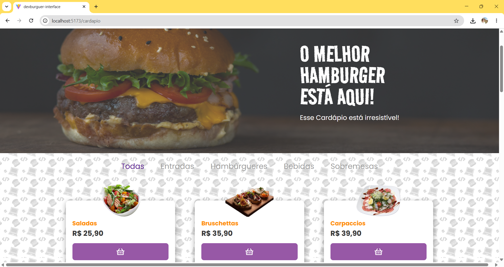
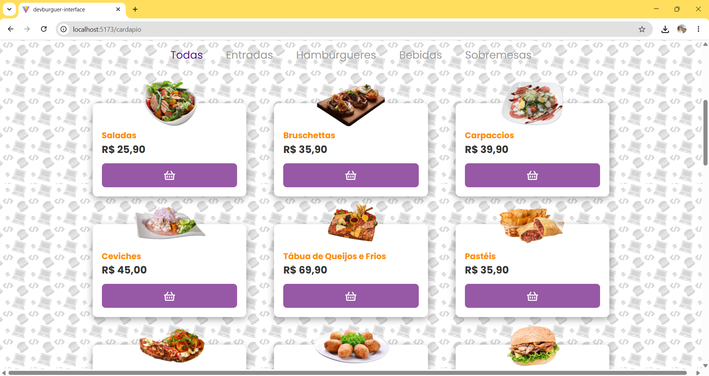
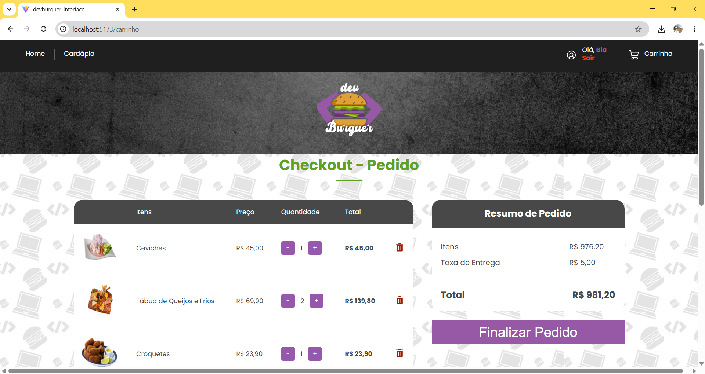
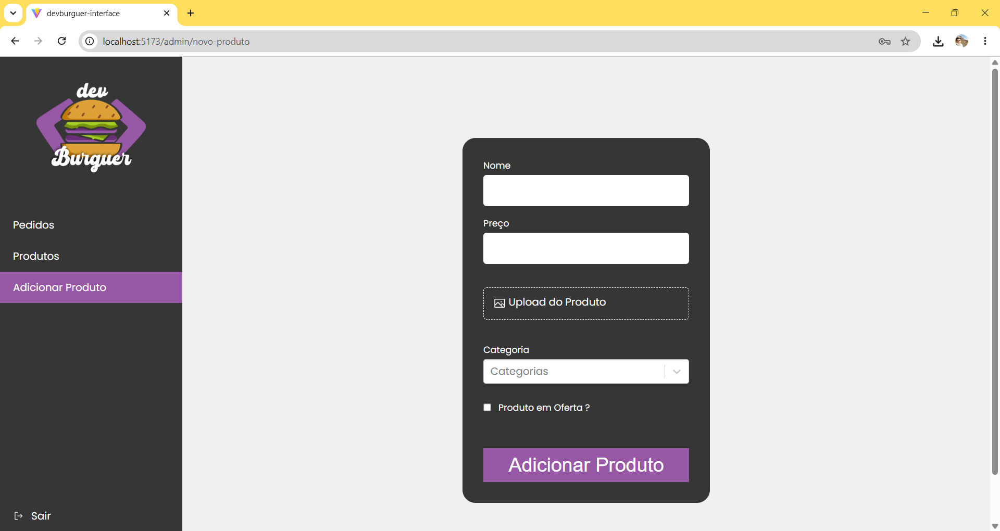

# 🚀 OrderFlow


OrderFlow é uma plataforma **Full Stack** para gerenciamento de pedidos online, desenvolvida com **React**, **Node.js** e **PostgreSQL**.

A aplicação permite autenticação de usuários, gerenciamento de produtos e categorias, processamento de pedidos e integração com pagamentos através do **Stripe**, oferecendo uma experiência completa tanto para clientes quanto para administradores.

---

# ✨ Funcionalidades

- ✅ Autenticação JWT
- ✅ Controle de acesso por perfil
- ✅ Cadastro de usuários
- ✅ Gestão de produtos
- ✅ Gestão de categorias
- ✅ Upload de imagens
- ✅ Carrinho de compras
- ✅ Processamento de pedidos
- ✅ Integração com Stripe
- ✅ Painel administrativo

---

# 🛠 Tecnologias

## Frontend

- React
- Vite
- React Router
- Styled Components
- Axios

## Backend

- Node.js
- Express
- Sequelize
- JWT
- Multer
- Stripe

## Banco de Dados

- PostgreSQL

---

# 🎥 Demonstração


---

# 📸 Screenshots
<h3>🏠 Página Inicial</h3>

<p align="center">
  
</p>

---

## 🔐 Login


---

## 🍔 Produtos



---

## 🛒 Carrinho



---

## 💳 Checkout


---

## ⚙️ Painel Administrativo



---

# 🚀 Como executar o projeto

Clone o repositório

```bash
git clone https://github.com/carloshenrique2026/orderflow-web.git
```

Entre na pasta

```bash
cd orderflow-web
```

Instale as dependências

```bash
npm install
```

Execute a aplicação

```bash
npm run dev
```

---

# 🔗 Backend

O backend da aplicação está disponível em:

https://github.com/carloshenrique2026/orderflow-api

---

# 🚧 Próximas Melhorias

- [ ] Documentação Swagger
- [ ] Docker
- [ ] Dashboard com métricas
- [ ] Busca de produtos
- [ ] Paginação
- [ ] Testes automatizados
- [ ] CI/CD com GitHub Actions

---

# 👨‍💻 Desenvolvedor

**Carlos Henrique da Silva Farias**

💼 LinkedIn  
https://linkedin.com/in/carloshenrique2026

🌐 Portfólio  
https://carloshenriqueprogramador.com.br

📦 Backend  
https://github.com/carloshenrique2026/orderflow-api